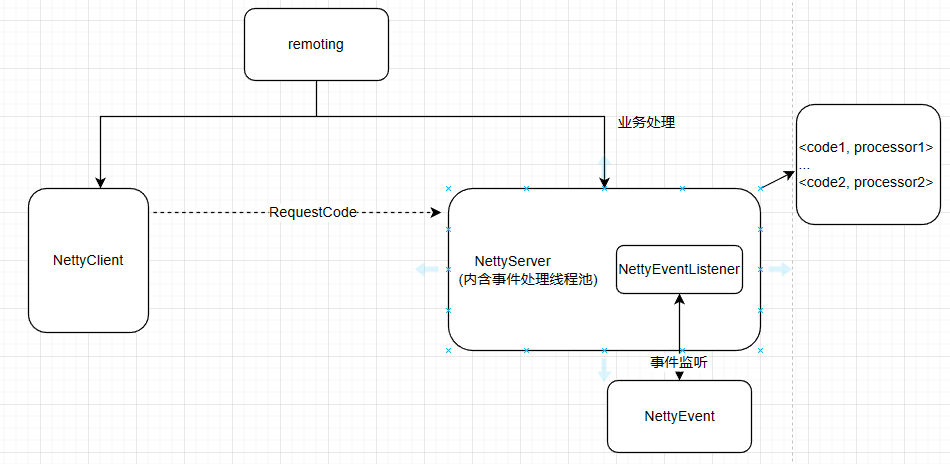

# tinymq
一个轻量的消息队列中间件


## remoting 模块
通信模块约定客户端与服务端的通信方式，和基本的心跳检测服务
心跳检测服务，检测到各种事件，将其作为事件推送到事件处理监听器服务
基于requestCode的业务方式，以requestCode来规范业务所需要的处理类NettyProcessor
提供三种通信方式
- sync, 同步通信
- async, 异步通信，含回送数据
- asyncOneway, 异步单向通信，不含回送数据




1.通过RemotingCommand作为交互实体；

2.服务器和客户端主要通过基于<请求码，处理器>对应的方式处理
客户端携带code作为业务标识，服务器提取对应的处理器，作为处理；处理器是外部注入的。

3.关于通道事件的监听，客户端与服务端是对等的，
//TODO: 两端都提供了事件注入和事件监听的机制，用来额外处理动态上下线，启动预处理之类的工作。


4.使用
- 创建客户端
```
        NettyClientConfig clientConfig = new NettyClientConfig();
        NettyRemotingClient client = new NettyRemotingClient(clientConfig);


        client.start();
```

- 客户端提供了三种方式
  ```
  client.invokeSync();
  client.invokeAsync();
  client.invokeOneway();
  ```
 
- 创建服务器端
```
        NettyServerConfig serverConfig = new NettyServerConfig();
        serverConfig.setListenPort(7800);

        NettyRemotingServer server = new NettyRemotingServer(serverConfig);
        // 注册<code, Processor>
        server.registerProcessor(100, new MyRequestProcessor(), null);

        server.start();
```

- 向服务端注册对应状态码处理器
```
static class MyRequestProcessor implements RequestProcessor {
        @Override
        public RemotingCommand process(ChannelHandlerContext ctx, RemotingCommand request) {
            String receive = new String(request.getBody(), StandardCharsets.UTF_8);
            System.out.println(receive);

            RemotingCommand response = RemotingCommand.createResponse(request.getCode(), "success");
            response.setBody(request.getBody());
            return response;
        }

        @Override
        public boolean rejectRequest() {
            return false;
        }
    }
```